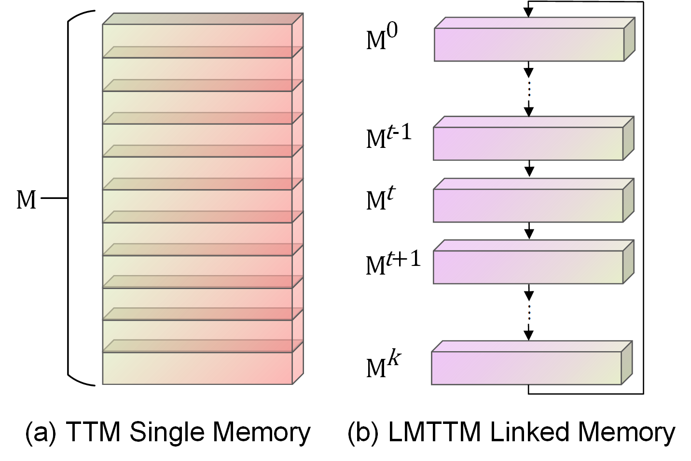
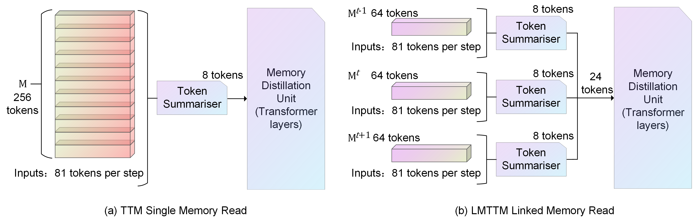
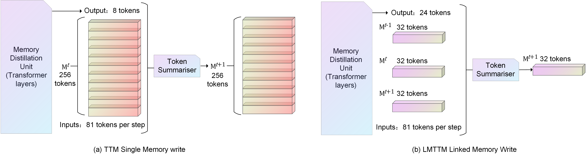

# [LMTTM-VMI: Linked Memory Token Turing Machine for 3D Volumetric Medical Image Classification](https://whkai666666.github.io/LMTTM-VMI_Page/)

Biomedical imaging is vital for the diagnosis and treatment of various medical conditions, yet the effective integration of deep learning technologies into this field presents challenges. Traditional methods often struggle to efficiently capture the spatiotemporal characteristics of image sequences, limiting memory utilization and model adaptability. 
To address this, we introduce a **L**inked **M**emory **T**oken **T**uring **M**achine (**LMTTM**), which utilizes external linked memory to efficiently process spatial-temporal dependencies in 3D volumetric medical images, aiding in accurate diagnoses. **LMTTM** can efficiently record the features of 3D volumetric medical images in an external linked memory module, enhancing complex image classification through improved feature accumulation and reasoning capabilities.
Our experiments on MedMNIST v2 datasets demonstrate the superiority of **LMTTM** over state-of-the-art models and its predecessor TTM, showcasing its potential to transform medical image interpretation and assist healthcare professionals in diagnosis and treatment planning.

------

- [LMTTM-VMI: Linked Memory Token Turing Machine for 3D Volumetric Medical Image Classification](#lmttm-vmi)
  - [Results](#results)
  - [RoadMap](#roadmap)
  - [Protocol](#protocol)
  - [LMTTM-Architecture](#lmttm-architecture)
    - [Linked Memory](#test)
    - [Read from Linked Memory](#read)
    - [Memory Distillation Unit](#mdu)
    - [Write to Linked Memory](#write)
  - [Requirement](#requirement)
  - [Preparation](#preparation)
  - [MedMNIST3D in MedMNIST v2](#medmnist3d)
    - [Train](#train)
    - [Test](#test)
  - [Acknowledge](#acknowledge)
  - [License](#license)

------

## Results

> LMTTM-VMI on AdrenalMNIST3D and OrganMNIST3D dataset 

[](https://www.youtube.com/watch?v=eWgUHj8lNns&list=PLfYk__bSOigA_EAE4iX1p0Pi3W59jn_GD)

> LMTTM-VMI on FractureMNIST3D and NoduleMNIST3D dataset 

[](https://www.youtube.com/watch?v=2RIpCtxMYEg&list=PLfYk__bSOigC-b67N_BBrCRtlJ9wW60ju&index=2&t=0s)

> LMTTM-VMI on VesselMNIST3D and SynapseMNIST3D dataset 

[](https://www.youtube.com/watch?v=2RIpCtxMYEg&list=PLfYk__bSOigC-b67N_BBrCRtlJ9wW60ju&index=2&t=0s)

## RoadMap

| Date   | Event                                                        |
| ------ | ------------------------------------------------------------ |
| 202403 | Finish the papers                       |
| 202402 | Preparing papers                                             |
| 202402 | Get Results on other five MedMNIST3D datasets  |
| 202402 | LMTTM can train on other five MedMNIST3D datasets                                   |
| 202401 | Get Result on the OrganMNIST3D  |
| 202401 | LMTTM can train on the OrganMNIST3D dataset                        |
| 202401 | Optimized LMTTM                     |
| 202312 | Try LMTTM on the OrganMNIST3D dataset                           |
| 202312 | Design the whole network about LMTTM                                       |
| 202311 | Start the idea about Linked Memory                                   |
| 202311 | Research the Memory module in TTM                                     |
| 202310 | TTM can do the Basic Classification on the OrganMNIST3D dataset         |
| 202310 | Try TTM on the OrganMNIST3D dataset                               |
| 202309 | Convert TTM source code from JAX to Pytorch                                     |
| 202308 | Start research on TTM                                              |

## Protocol

-  represents memory blocks at different times, the three moments of memory are the past moment, this moment, and the next moment.
-  represents the input at moment t.
-  represents the output features obtained after MDU output. It is used for result classification and writing to memory.
-  represents the size of the memory block, respectively the memory block length and dimension.

-  denotes the feature information read from memory at different moments in time.

## LMTTM-Architecture

Schematics of the Linked Memory Token Turing Machine (LMTTM). On the left, the network's processing at time stamp $t$ is depicted, where the current memory block  and its adjacent blocks  and  are synergistically processed by the Tri-Temporal Memory Collaborative (T-TMC) module, which we will refer to as Simplified Memory. Simplified memory, along with preprocessed input tokens, is read through the Read module, and the extracted information is then refined into more efficient output tokens by the Memory Distillation Unit(MDU) for image classification. The simplified Memory, input tokens, and output tokens are then written in the subsequent Memory block  via the Write module, completing the LMTTM cycle for time stamp $t$ and facilitating a linked cyclic update of the Memory content. The right side shows a similar process for time stamp $t+1$.


### Linked Memory

Illustration of different memory. (a) is the memory structure of TTM, where the
entire memory block is iteratively updated during the interaction. (b) is the memory
structure of our LMTTM, which can be viewed as a chain of k memory units linked
together, and is iteratively updated one memory unit at a time during the interaction.


### Read from Linked Memory

Illustration of different Reads. (a) is the entire block of memory that will be read by the TTM. (b) is the coordinated read operation for the current moment $t$, the past moment $t-1$ and the future moment $t+1$.


### Memory Distillation Unit

In the LMTTM architecture, the processing unit is designed as , which receives the tokens $3r$ obtained from the read operation  and processes them. The MDU outputs a set of vectors  containing the $3r$ tokens, which are used in subsequent write operations and in generating predictions in the 3D volumetric medical image classification task. For tasks that require predictions at each time stamp, we introduce a fully connected layer after  to enhance the classification capability of the model, which is implemented as , where  is the weight matrix of the fully connected layer used to map  to the input space of the classifier. This produces the final classification prediction.

### Write to Linked Memory

Illustration of different Writes. (a) is the entire block of memories from the current moment in TTM being written to the next moment in the entire block. (b) is the entire block of tri-temporal memories from the current moment $t$, the past moment $t-1$, and the future moment $t+1$ being synergized and written to the future moment $t+1$ in LMTTM.


## Requirement

| Name  |Version   |
| ------------ | ------------ |
|  Python | 3.8  |
|  CUDA | >=10.1  |
|  Pytorch | 1.12.1  |

The rest of the environment is installed with the following command
```shell
cd <project path>
pip install -r requirement.txt
```
## Preparation

Clone the repository
```shell
git clone <repository url>
```
## MedMNIST3D in MedMNIST v2
[MedMNIST v2](https://github.com/MedMNIST/MedMNIST) contains a collection of six preprocessed 3D volumetric medical image datasets. It is designed to be educational, standardized, diverse, and lightweight and can be used as a general classification benchmark in 3D volumetric medical image analysis.  
The program will automatically download the corresponding dataset at runtime.

 For different datasets and tasks, different parameters need to be configured.
The parameters are configured in `<path>\config\base.json`.
To run the program, you need to change the `dataset_name` field in `base.json` to the name of the corresponding dataset, which can be OrganMNIST3D, SynapseMNIST3D, AdrenalMNIST3D, FractureMNIST3D, NoduleMNIST3D, VesselMNIST3D, and also in `out_class_num` you need to change the number of classes in the corresponding dataset. VesselMNIST3D, also in `out_class_num` you need to modify the number of classes in the corresponding dataset.


### Train
Modify the `dataset_name`, `out_class_num` and `epoch` parameters in the configuration file `<path>\config\base.json`.  
And then activate your virtual environment, followed by executing `python train.py base.json`. 

###  Test

As with the TRAIN process, modify the corresponding parameters, then activate the virtual environment and execute `python predict.py base.json`

## Acknowledge
This work is based on [TTM(Token Turing Machine)](https://arxiv.org/abs/2211.09119) and inspired by [CMN (Collaborative Memory Network)](https://ieeexplore.ieee.org/document/9264159).

## License

LMTTM's code is released under the Apache License 2.0. A permissive license whose main conditions require preservation of copyright and license notices. Contributors provide an express grant of patent rights. Licensed works, modifications, and larger works may be distributed under different terms and without source code.See [LICENSE](https://github.com/WHKai666666/LMTTM-VMI/blob/main/LICENSE "LICENSE") for further details. 

------

